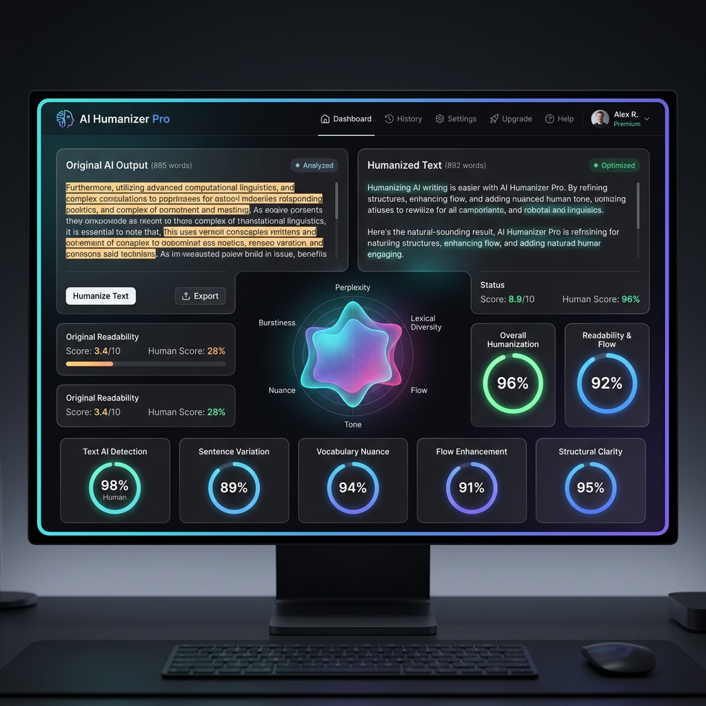

# AI Humanizer Pro

<p align="center">
  
</p>

A production-grade, local-first web application designed to help users analyze and humanize AI-generated text. It uses client-side linguistic heuristics to make robotic AI-style text sound natural, varied, and fluent while 100% preserving factual data (names, dates, numbers, URLs, and references).

This application runs entirely in the browser with **no backend APIs, no external libraries, and no frameworks**.

## Core Features

### 1. Heuristic Rewrite Engine
An NLP rule-based pipeline that processes text paragraph by paragraph and sentence by sentence:
- **Protected Entity Extraction**: Identifies and locks proper nouns, URLs, emails, dates, numbers, and markdown citations. These are restored post-rewrite.
- **Active Voice Promotion**: Identifies passive voice structures (e.g., "was written by") and flips them into clear active sentences where possible.
- **Filler Word & Redundancy Reduction**: Identifies and removes common conversational fluff (e.g., "needless to say", "in order to").
- **Sentence Restructuring (Splitting & Merging)**: Splits bloated sentences, swaps clauses, and merges choppy sentences.
- **Vocabulary Diversity**: Intelligently swaps robotic terms with human equivalents.
- **Style Profiles**: Adapt settings based on Casual, Balanced, Professional, or **Creative (Narrative)** profiles.

### 2. Linguistic Analyzer & Diagnostics Dashboard
Computes a complete profile of the text:
- **Readability & Grade Levels**: Flesch-Kincaid Reading Ease, Gunning Fog Index, and estimated readability level.
- **Writing Characteristics**: Character, word, sentence, and paragraph counts.
- **Linguistic Metrics**: Lexical diversity percentage, transition word density, passive voice count, and sentence length variety.
- **Interactive Canvas Visualizations**: Renders:
  - **Generative "Linguistic DNA" Blob**: A fluid wave blob representing text flow (AI shows as a rigid static hexagon, humanized text shows as a breathing, rotating, glowing liquid shape).
  - **Radar Properties Chart**: Visualizes text features (Flow, Variety, Diversity, Formality, Grammar).
  - **Sentence Length Distribution Graph**: Plots rhythm and variety comparisons.

### 3. Desktop SaaS User Experience
- **Adaptive Layout**: Dual text panel layout (Original vs. Humanized) with visual diff change highlights (hover to view original values).
- **Interactive Synonym dropdown**: Click any highlighted synonym to view alternatives and update text dynamically.
- **State Controls**: Full support for Undo/Redo stacks, history log, and starred favorites saved to local storage.
- **Theme Engine**: Seamless switching between dark glassmorphism (default) and crisp light glassmorphism.
- **Professional Exports**: Export to plain `.txt` file, or trigger native browser printing styled as a professional report card.
- **Offline Support**: Cache assets via service worker for 100% offline support.

---

## Visual Showcase

<p align="center">
  <h3>Interactive SaaS UI Dashboard</h3>
  
  <br>
  <em>SaaS-grade Dark Mode dashboard with dual text panes, highlights, and interactive canvas components.</em>
</p>

<p align="center">
  <h3>Generative "Linguistic DNA" Flow Blob</h3>
  
  <br>
  <em>Generative fluid wave blob visualizer indicating the rhythm and organic flow transitions of humanized writing.</em>
</p>

---

## File Structure

```
.
├── index.html              # Main HTML5 layout shell and SVG sprite assets
├── service-worker.js       # Offline cache manager
├── css/
│   └── style.css           # Premium glassmorphism design, dark/light themes, and print rules
└── js/
    ├── engine/
    │   ├── analyzer.js     # Text parsing and metrics math
    │   └── rewrite.js      # NLP rules and heuristics rewrite logic
    └── ui/
        ├── app.js          # Coordination, listeners, history, & exports
        └── dashboard.js    # High-DPI HTML5 Canvas charting
```

---

## Getting Started

1. Double-click or open `index.html` in any modern web browser (Chrome, Firefox, Safari, Edge).
2. Paste any AI-generated text in the left pane.
3. Configure the **Humanization Strength** and **Formality Shift** profiles in the sidebar.
4. Click **Humanize Content** (or press `Ctrl + Enter`).
5. Observe the metrics and charts update dynamically in the dashboard below.

### Keyboard Shortcuts
- `Ctrl + Enter`: Humanize Content
- `Ctrl + Z`: Undo text input edits
- `Ctrl + Y`: Redo text input edits
- `Ctrl + S`: Export Humanized Text as a `.txt` file
- `Ctrl + Alt + C`: Copy output to clipboard

---

## Technical Performance Details
- **Zero-Dependency Code**: Avoids external network calls or node modules. Loaded files are small (CSS & JS are less than 50KB combined).
- **Render Performance**: Canvas visualizers use standard `requestAnimationFrame` for 60fps enter-animations.
- **Memory Footprint**: Text structures are tokenized iteratively, ensuring low memory consumption even with texts exceeding 10,000 words.
- **Disclaimer**: Write-analyzer scores and Humanized percentages are heuristic estimations. Results are not mathematical guarantees of bypassing detector networks.

---

## License

This project is licensed under the [MIT License](LICENSE) - see the LICENSE file for details.

